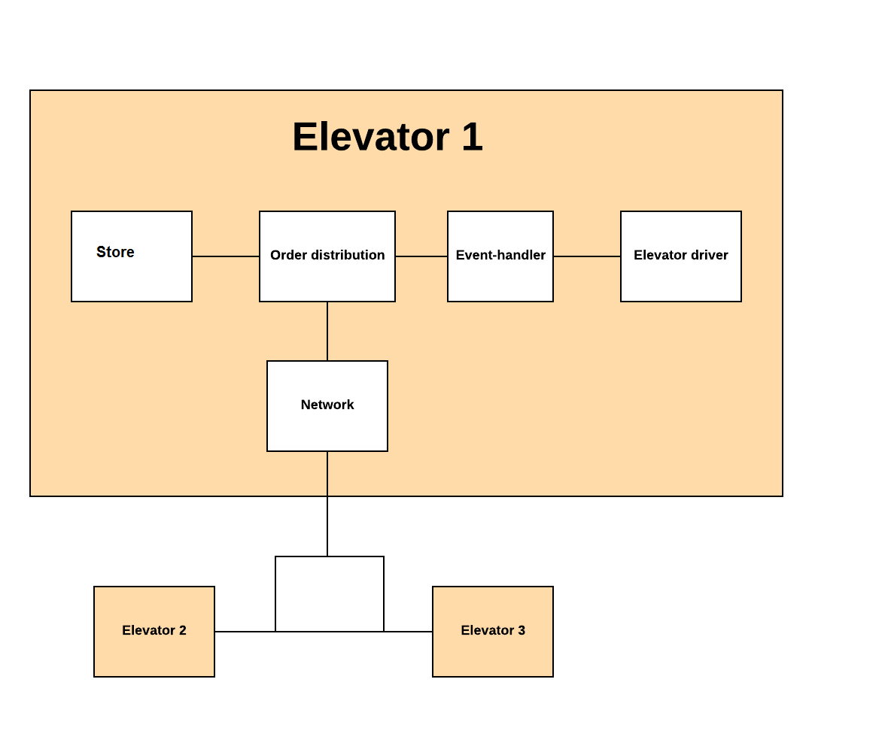

# TTTK4145 Elevator project - Group 49
Software for running `n` elevators working in parallel across `m` floors. Written in Golang. The behaivour and fault tolerance are written under the assumption that *at least one*  elevator is working properly

---
## Instructions

To run the elevator(s), navigate to the folder with the `main.go` file and run in the shell:
```
    ~$ go run main.go [PORTNR] [ELEVATORNR]
```
E.g if you want to run elevator nr 0 at port 1234 you would type
```
    ~$ go run main.go 1234 0
```
Make sure to have the elevator server running, either the simulator or the real elevators on the lab. Run the elavtorserver on port
15657 + [ELEVATORNR]

E.g if you want to run a server supporting elevator nr 1, you would type
```
    ./SimElevatorServer --port 15658
```

## Implementation
The elevator software consists of 4 main modules:
- Store, tasked with storing the state of all elevators.
- Network, tasked with assuring communication between all elevators. A ring topology has been used.
- Oder distributor, tasked with assigning (hall call) orders to the desired elevator.  
- Event handler, tasked with registering calls and operate the elevator





